# Finger Joints Live

This is a live palette remix of the original Finger Joints add-in created by Florian Pommerening. You can find his original repository here: [FlorianPommerening/FingerJoints](https://github.com/FlorianPommerening/FingerJoints).

This add-in for Autodesk Fusion can create a finger joint (box joint) from the overlap of two objects. Although, not specifically designed for this, the add-in also works for lap joints and can cut pieces into slices.

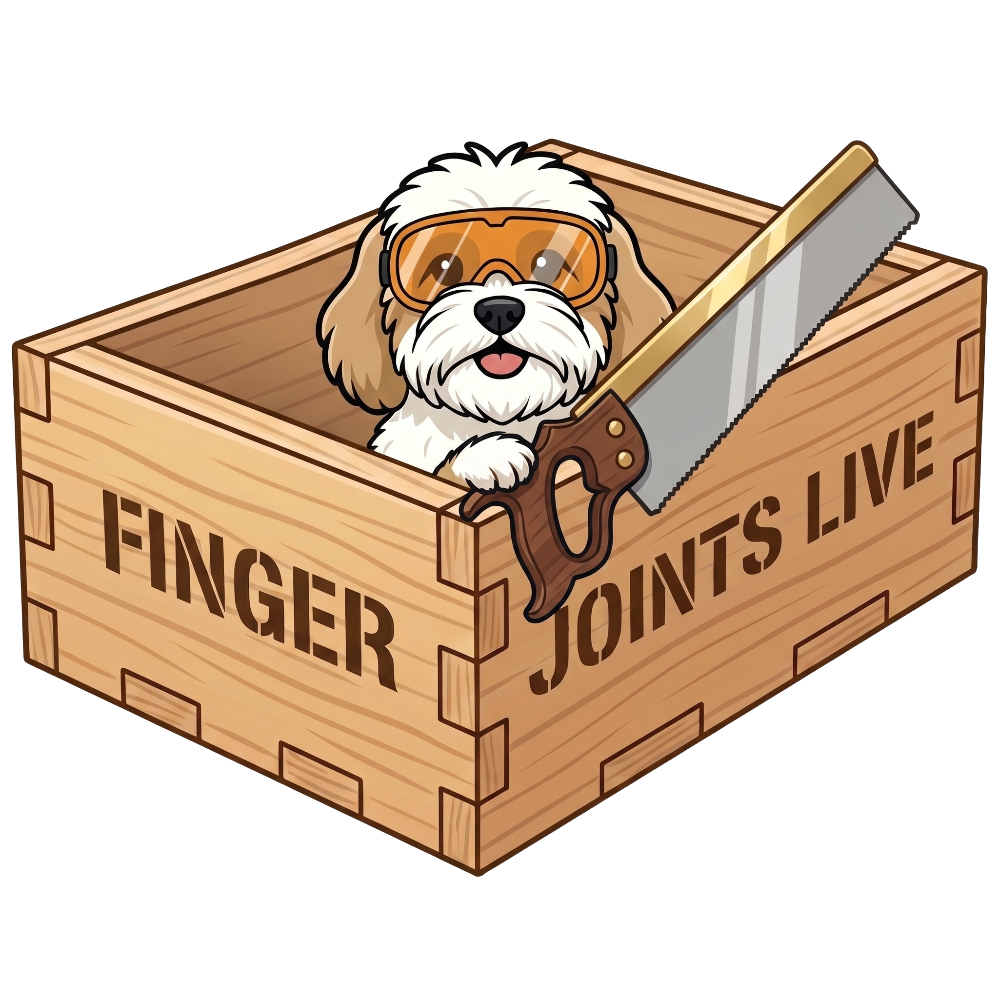

## Installation

### Manual Installation Options

This script requires a quick manual installation. You can choose to install it in Fusion's default scripts directory or a custom folder of your choice.

#### Option 1: Install in the Default Fusion Directory
1. **Download:** Download the source code as a ZIP file and extract the `FingerJointsLive-main` folder. Rename the folder to `FingerJointsLive`.
2. **Move the Folder:** Move the entire `FingerJointsLive` folder into your native Fusion Scripts directory:
   * **Windows:** `%appdata%\Autodesk\Autodesk Fusion 360\API\Addins`
   * **Mac:** `~/Library/Application Support/Autodesk/Autodesk Fusion 360/API/Addins`
3. **Open Fusion:** Press `Shift + S` to open the **Scripts and Add-Ins** dialog.
4. **Run the Script:** Make sure the **Add-ins** filter checkbox is checked. You should see **LiveUtilities** in the list of add-ins. You may want to check the 'Run on startup' option so it automatically runs when Fusion starts. Click the **Run** icon to execute the add-in.

#### Option 2: Install in a Custom Directory
1. **Download:**Download the source code as a ZIP file and extract the `FingerJointsLive-main` folder. Rename the folder to `FingerJointsLive`.
2. **Organize:** Create a dedicated folder on your computer for your Fusion tools (e.g., `Documents\Fusion_Tools`) and move the `FingerJointsLive` folder inside it.
3. **Open Fusion:** Press `Shift + S` to open the **Scripts and Add-Ins** dialog.
4. **Add the Add-in:** Click the grey **"+"** icon next to the search box at the top of the dialog and select **Script or add-in from device**.
5. **Locate:** Navigate to your custom folder, select the `FingerJointsLive` folder, and click **Select Folder**.
6. **Run the Add-in:** Make sure the **Add-ins** filter checkbox is checked. You should now see **FingerJointsLive** listed. You may want to check the 'Run on startup' option so it automatically runs when Fusion starts. Click the **Run** icon to execute the add-in.

## ✨ What's New in FingerJointsLive (The Remix)

This "Live" version takes the core mathematical engine of Florian's original add-in and wraps it in a modern, modeless HTML palette with several workflow enhancements:

* **Persistent Live UI:** The palette docks on the side of your screen. You can tweak parameters, change settings, and see results without a modal dialog blocking your view or closing after every tweak.
* **Multi-Body Selection:** You are no longer limited to joining just two bodies at a time! You can now select multiple "First Bodies" (e.g., two opposite walls of a box) and multiple "Second Bodies" (the adjoining walls). The add-in will calculate the intersections and generate the joints for all of them at once.
* **Non-Destructive Live Preview:** Instead of computing heavy timeline features to show a preview, FingerJointsLive renders temporary "ghost" bodies on the canvas. This keeps your timeline clean and makes tweaking dimensions lightning-fast. Once you are happy with the preview, hit "Generate Finger Joints" to commit the changes to the timeline in a single undo step.
* **Preset Saving:** Save your favorite joint configurations as named presets directly in the palette.

## Original Usage Guide (For Reference)

*Note: The following documentation and images are from Florian's original add-in. The core concepts, mathematical principles, and terminology (like Dynamic Sizing, Placement Types, etc.) still apply perfectly to this Live remix. I will be updating this section with new screenshots specific to the new UI in the future.*

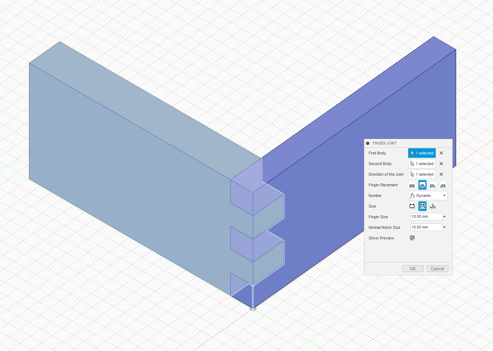

Select two overlapping bodies and a direction. The direction is required, so the add-in knows in which plane to cut. In most cases, you probably want an edge that runs along the joint as shown in the picture.

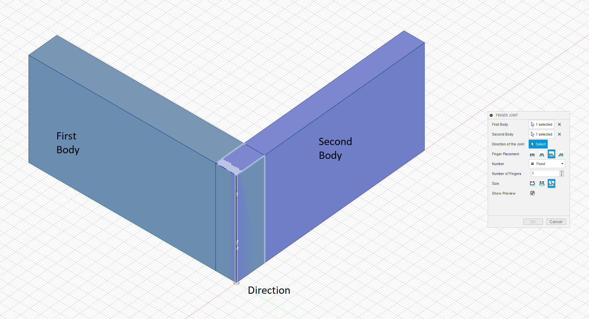

The next setting controls whether the first body has fingers on both ends, notches on both ends, or a finger on one end and a notch on the other. In the next picture, we place three fingers on the first body with different settings, the number of fingers on the second body adjusts accordingly.

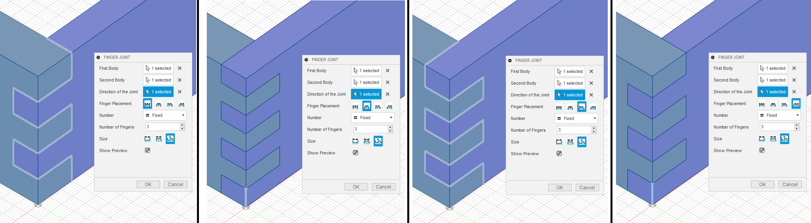

The next settings determine how the size of the overlap is distributed between fingers of the first body and fingers of the second body (as we view everything from the perspective of the first body, we call fingers of the second body "notches").

When the number of fingers is fixed, we can specify their size in three ways. In the example above, we chose to have fingers and notches of equal size. Instead, we can chose to fix the size of either fingers or notches (the other size is determined automatically). The next picture shows the effect of fixing the size of fingers or notches to 5mm.

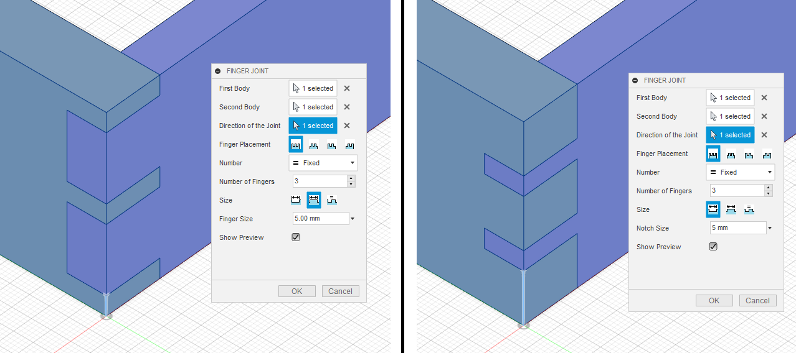

Finally, instead of fixing the number of fingers, we might want to have both fingers and notches of a certain size and place as many fingers as will fit along the joint. Fixing both sizes could lead to cases where one body ends in half a finger, so instead, we only fix either the size of fingers or notches and specify a minimal size for the other. For example, the following picture fixes the size of a finger to 9mm and uses a minimal notch size of 5mm. The height of the joint is 50mm, so using four 9mm fingers and three 5mm notches would exceed the size by 1 mm. Instead, the add-in uses three 9mm fingers and increases the size of the two notches to 11.5mm. Likewise, we could fix the size of notches and make the size of fingers dynamic, or we could require that fingers and notches have the same size.

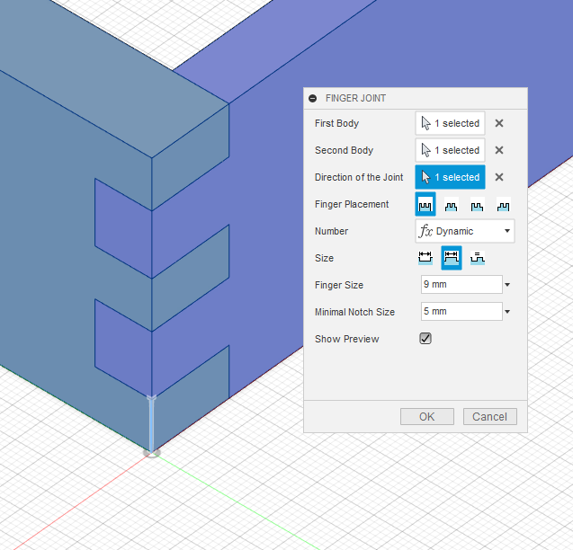

Starting with version 1.1 the add-in can also add a small gap between the fingers and notches for an easier fit
of the produced parts.

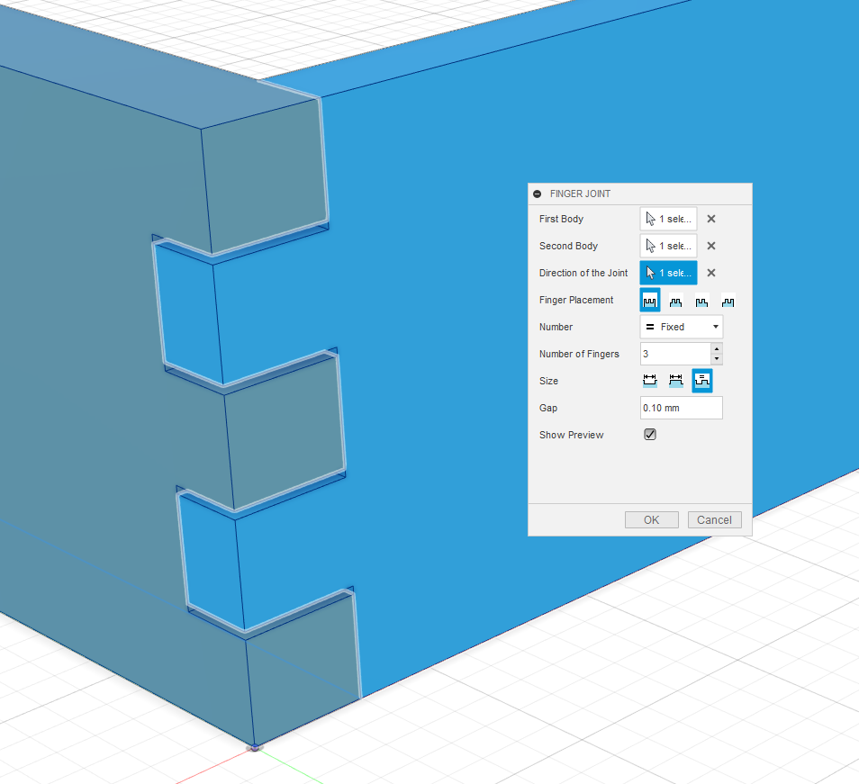

An experimental option of adding a gap between the joint and the parts was added in version 1.2.
Currently, the gap size will not always match the entered value and might be different on both parts
if their overlap is not a square. Use at your own risk and experiment with different settings
for a useful distance.

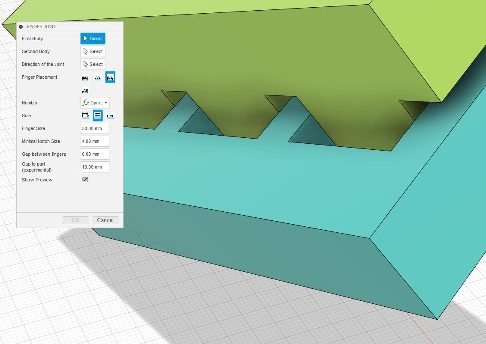

Of course, the objects you join do not have to be rectangular and can overlap in multiple places.

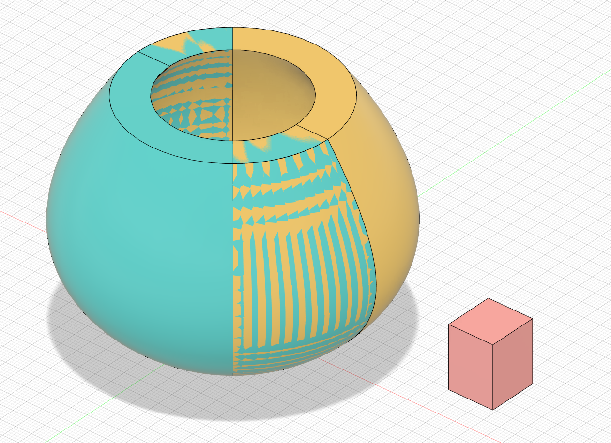
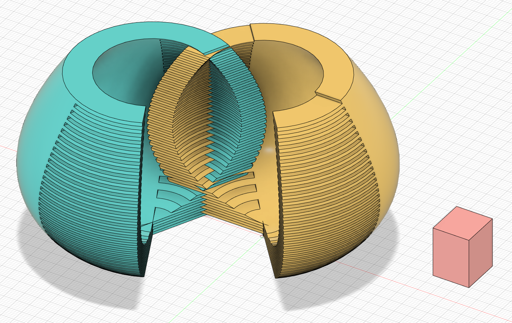

## Other Uses

In addition to creating finger joints, the add-in can be used to create lap joints and cut pieces into slices.

### Lap Joints

To create a lap joint, start with two overlapping pieces and create a finger joint with one finger placed asymmertically on the start or end of the first body.

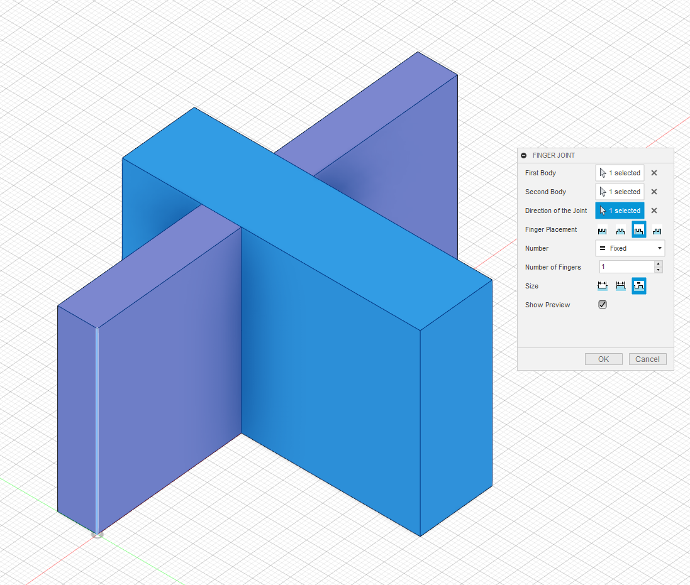
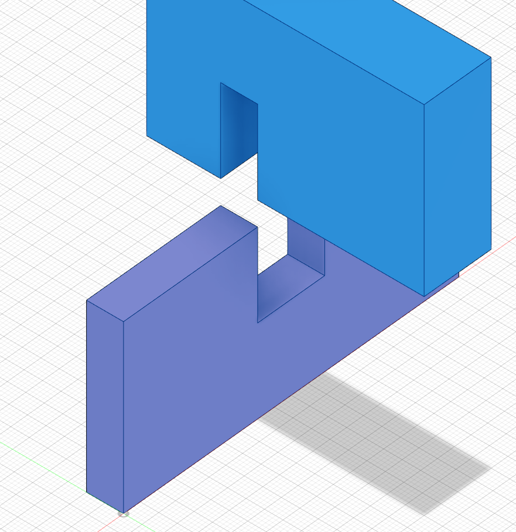

### Slicing

This is not really by design but you can duplicate a body so it perfectly overlaps with itself, then create a finger joint between the
copy and the original. This will slice the body along your chosen axis.

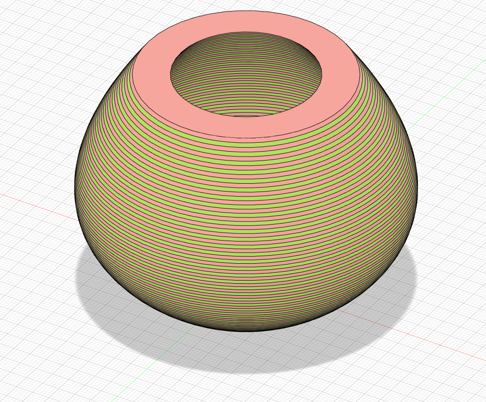
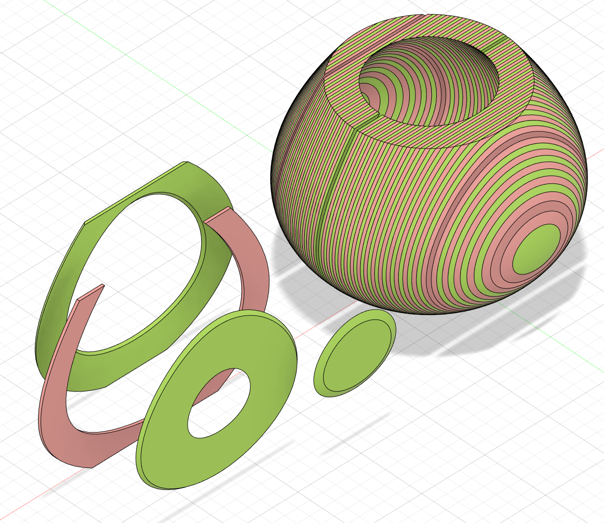

## Issues

If you find any issues with this remixed add-in, please report them on this project's GitHub issue tracker.

## Contributing

Pull requests for fixes and new features are very welcome.

The add-in is currently not fully parametric in the timeline, but this live palette version aims to provide a much more interactive experience.

## License

This add-in is based on the original work by Florian Pommerening which is licensed under a Creative Commons Attribution-NonCommercial-ShareAlike 4.0 International License.